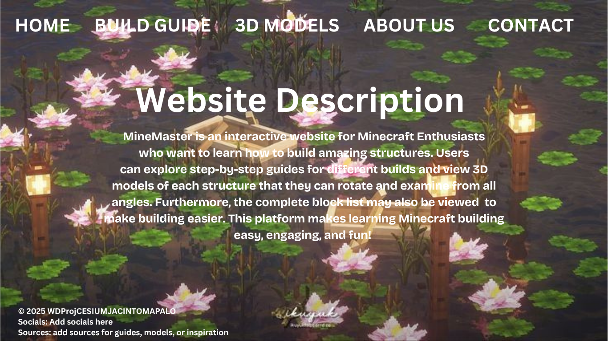
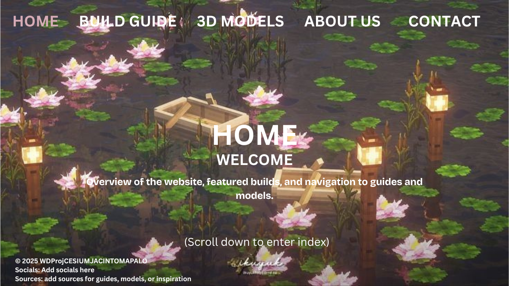
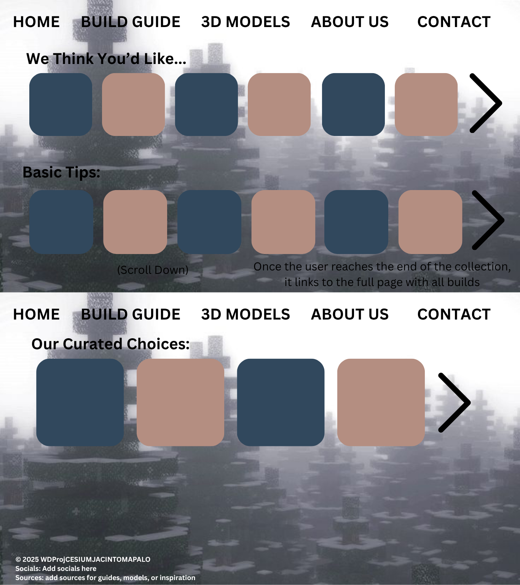
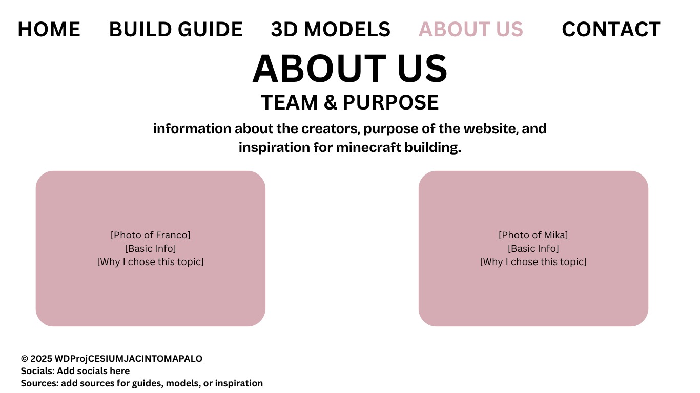
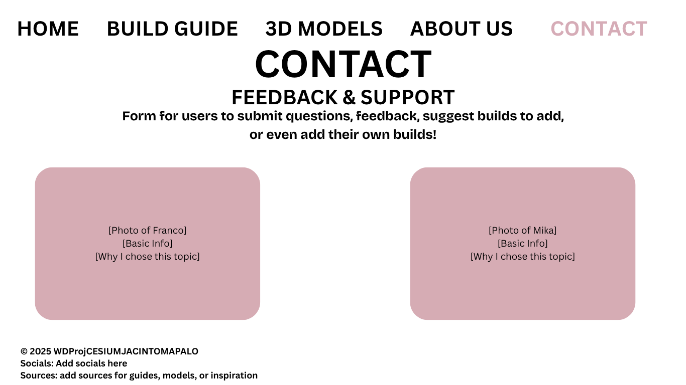
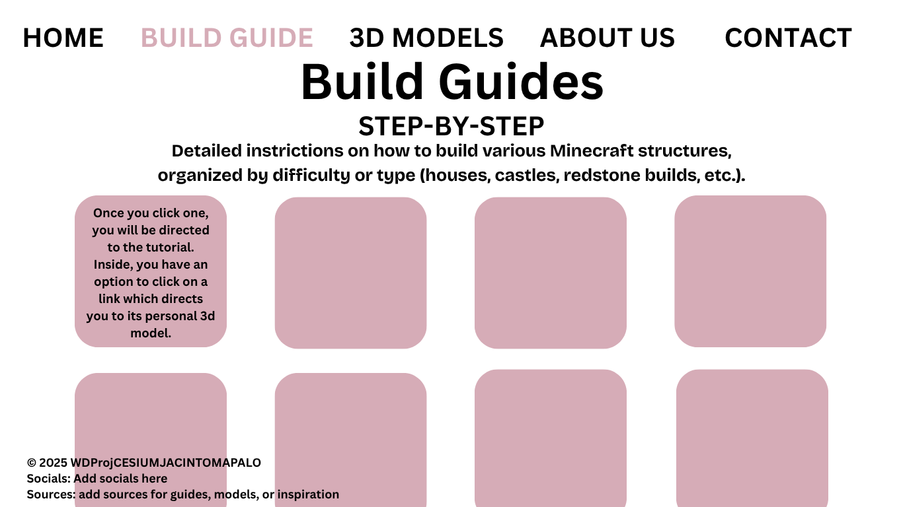
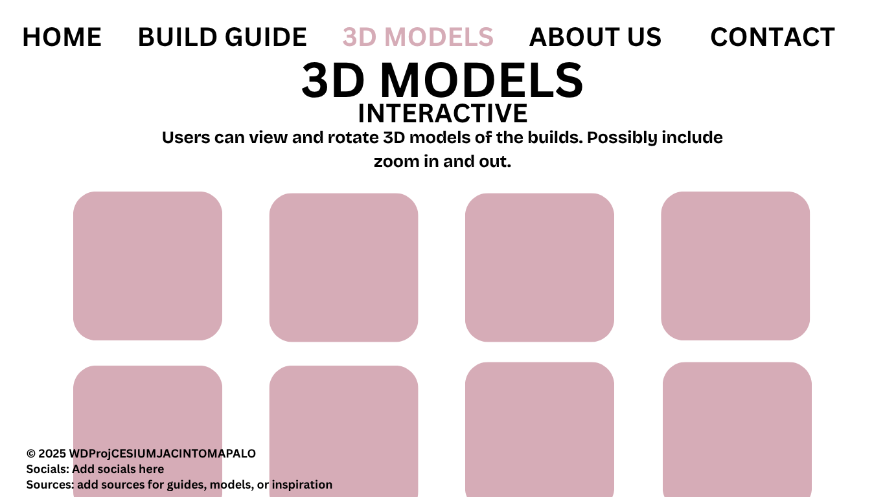
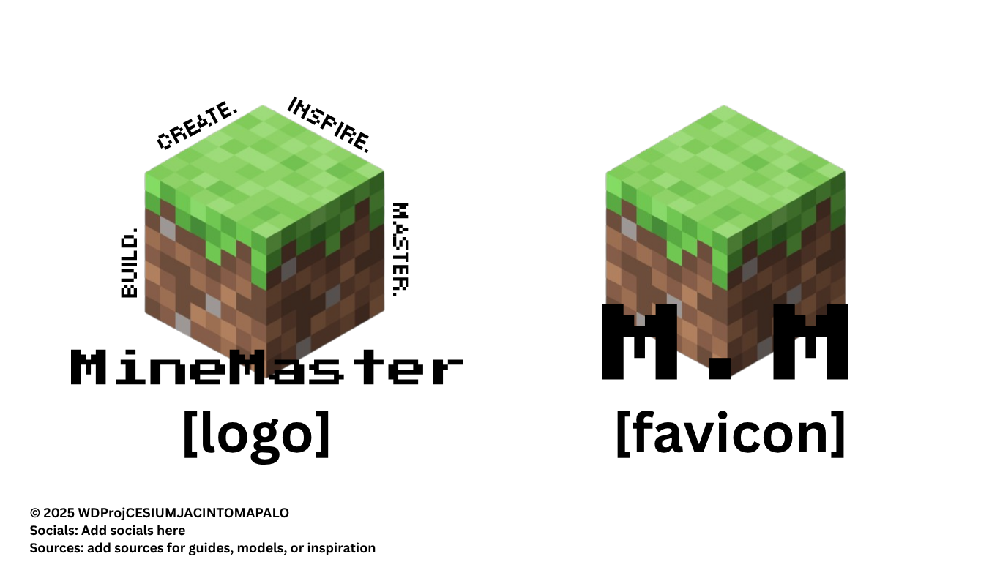
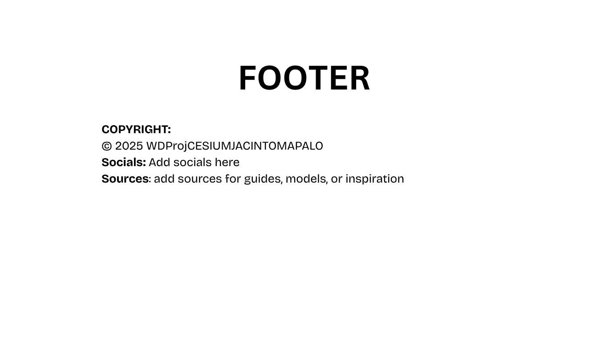
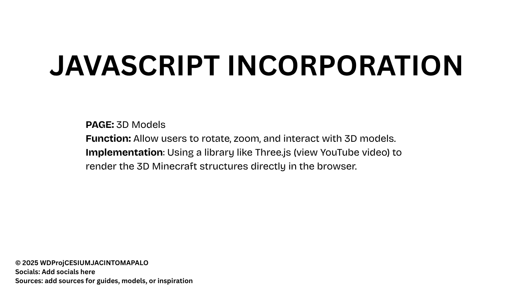

# scroll down to enter next page (Description) (Main Color Palette will be Pink & White)

# scroll down to enter home page

# scroll down to enter index

# from here, either click one of the links at the top, OR scroll to the end of the feed, where either the build guides or 3d model pages are. Scroll down to enter about us

# scroll down to enter the contact page

# from the header/index, you can enter into either the build page...

# ...or the 3d models page

# every page (excluding the opening and description) will be accessible from the header.
# this will be our logo & the favicon to be used:

# this will be our footer:

# this will be how we incorporate JS:

## HTML FORM DESIGN (Sign-Up / Login Form)

### Purpose of the HTML Form
The website will include a Sign-Up / Login Form that allows users to create an account to personalize their experience. The purpose of this form is to let users save their username and password locally, so the website can remember them on different devices or occasions. For example, a logged-in user could have a personal build list page or see "Welcome, [username]" messages while browsing the guide.

### Information Collected by the Form
The HTML form will collect the following information:
- Username (text input)
- Email (text input)
- Password (password input)
- Confirm Password (password input)
- Submit Button to create the account

### Login Form
Users who have already signed up can log in using a short login form, which asks for their username/email and password to access their saved account.

### How the Form Is Used
After the user submits the sign-up form, their account information is saved in the browser (locally). They can log in later to access their personalized features. Example pages that use this data include:
- **Personal Build List Page** — shows the builds the user has saved  
- **Welcome / Dashboard Page** — greets the user by username

### How the Data Is Saved on the User's Computer
The user's account data will be stored using **localStorage** in the browser. This allows:
- Data to persist even after refreshing the page  
- Multiple pages of the website to access the user information  
- Safe local storage without needing a server or database